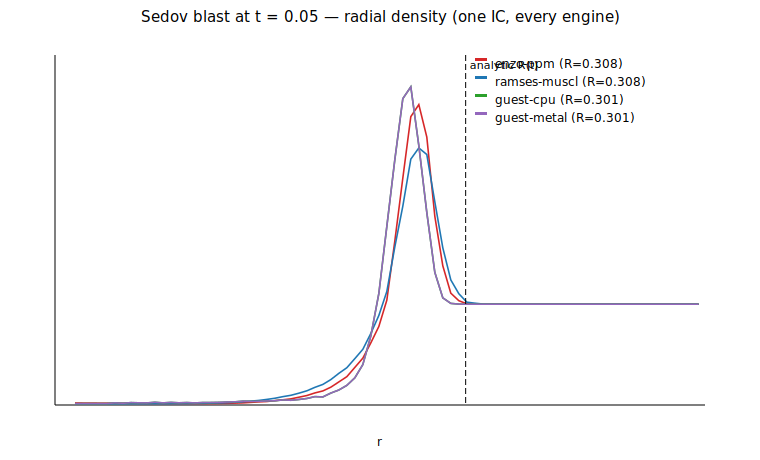

# One Sedov blast, every engine (ADR-0006)

The SAME discrete IC — uniform ρ = 1.0, a thermal bomb of measured energy in a sphere of radius 0.05 at the box center — injected through each code's live-field bridge and evolved to t = 0.05.  Oracle: the Sedov–Taylor radius R(t) = ξ₀(E t²/ρ)^{1/5}, ξ₀ = 1.1517 (γ = 1.4), with each run's measured injected E₀.

| engine | cells | steps | wall-clock [s] | E₀ (measured) | R_shock | R analytic | R/Rₐ | Δmass/mass | Δenergy/E |
|--------|-------|-------|----------------|----------------|---------|------------|------|-----------|-----------|
| enzo-ppm | 262144 | 217 | 65.89 | 1 | 0.3078 | 0.3475 | 0.886 | 6.99e-15 | 4.98e-13 |
| ramses-muscl | 262144 | 214 | 6.98 | 1 | 0.3078 | 0.3475 | 0.886 | 3.57e-14 | 3.85e-12 |
| guest-cpu | 262144 | 225 | 18.61 | 1 | 0.3011 | 0.3475 | 0.866 | 7.88e-15 | 4.02e-12 |
| guest-cpu-resident | 262144 | 164 | 8.20 | 1 | 0.3011 | 0.3475 | 0.866 | 1.21e-14 | 4.02e-12 |
| guest-metal | 262144 | 225 | 8.10 | 1 | 0.3011 | 0.3475 | 0.866 | 1.87e-08 | 3.22e-09 |
| guest-metal-resident | 262144 | 164 | 1.68 | 1 | 0.3011 | 0.3475 | 0.866 | 1.34e-08 | 3.45e-09 |

All engines run the identical injected IC on their own mesh/scheme: Enzo PPM (DirectEuler), RAMSES unsplit MUSCL+HLLC, and the PPMKernels guest slot (PLM+HLLC, Hancock) on RAMSES's mesh — on the CPU in f64 and on the Metal GPU in f32.
