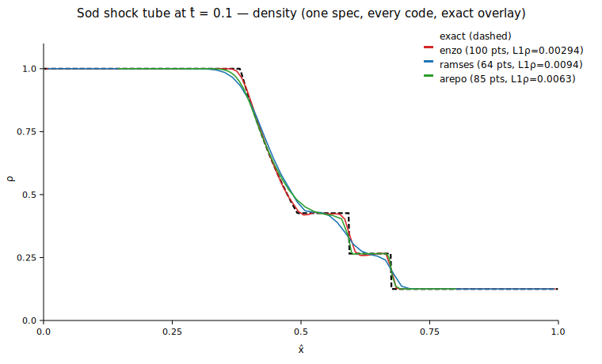

# One Sod shock tube, every code (ADR-0006 Phase 2)

Spec: (ρ,u,p)L = (1.0, 0.0, 1.0) | (ρ,u,p)R = (0.125, 0.0, 0.1), γ = 1.4, x̂₀ = 0.5, compared at t̂ = 0.1.

Each code ran its NATIVE setup path (Enzo `SodShockTube.enzo`, a generated RAMSES namelist, Arepo's `shocktube_1d` example); the canonical-state adapters (`MultiCode.CellSet`) did all conversion at the bridge boundary.

## Conservation ledgers (normalized units; analytic reference: mass = 0.5625, energy = 1.3750000000000002)

| code | cells | t̂ | mass | Δmass/mass | energy | Δenergy/energy | L1(ρ) | L1(u) | round-trip |
|------|-------|----|------|-----------|--------|----------------|-------|-------|------------|
| enzo | 100 | 0.1 | 0.5625 | 1.58e-15 | 1.375 | 6.46e-16 | 0.002942 | 0.004897 | bit-identical ✓ |
| ramses | 2097152 | 0.1 | 0.5625 | 3.20e-12 | 1.375 | 5.00e-12 | 0.009395 | 0.01991 | bit-identical ✓ |
| arepo | 128 | 0.1 | 0.5625 | 3.95e-16 | 1.375 | 4.84e-16 | 0.006296 | 0.01425 | bit-identical ✓ |

## Notes

- **enzo**: PPM DirectEuler, 100 cells, 1-D; bridge mass integral matches the adapter to round-off.
- **ramses**: unsplit MUSCL + HLLC, 128³ uniform, 3-D double-length tube (periodic seam outside the window); transverse density scatter 0.0.
- **arepo**: moving-mesh finite volume, 128 cells; box 20, TimeMax = 20·t̂ ⇒ the identical normalized problem; profile windowed to the periodic-seam-clean region (0.13899999999999998, 0.804).
- Energy drift reflects each code's boundary treatment and is bounded by the waves staying inside the box at t̂ = 0.1.
- The Arepo round-trip gate covers its settable conserved surface (cell energy + momentum); density is derived by Arepo and not directly settable.
